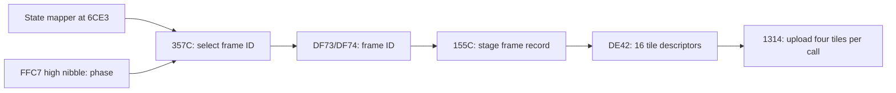

# Animation frame selection and staging

The opening-scene replay verifies **66 frame selections, 24 complete frame-record
loads and 1,152 staged descriptor bytes** during frames 2480–2560. The observed
record IDs are 147 and 163–172. These IDs identify ROM records; individual pose
names have not yet been assigned. See [animation-evidence.json](animation-evidence.json).



## Selection: fixed ROM 00:357C

`tintin_select_actor_frame_id` calls the mapper at `$6CE3` using `$FFC6`, then
selects ROM bank 9. Its returned animation index selects a little-endian relative
offset at `$4000 + 2 * index`. The selected frame ID is the little-endian word at
`$4084 + relative_offset + 2 * phase`, where phase is `$FFC7 >> 4`.
It writes the ID to `$DF73/$DF74` and explicitly selects ROM bank 1 before returning.
The mapper and the valid extent of the directory are still unknown; the decoder's
numeric bounds are not a claim that every index is an animation.

## Staging: fixed ROM 00:155C

`tintin_stage_actor_frame` returns unless `($DF72 & $7F) == 0`. It preserves
previous-frame state and handles facing-related metadata before the recovered
record-copy portion. The selected frame's record begins at bank 9 address
`$4354 + frame_id * 51`.

| Record offset | Bytes | Meaning / destination |
|---|---|---|
| 0 | 1 | Metadata to `$C490`; later conditionally negated for facing |
| 1 | 1 | Metadata to `$C491` |
| 2 | 1 | Metadata to `$C48D`; full interpretation pending |
| 3–50 | 48 | 16 triples: encoded bank, address low, address high |

The first two metadata bytes appear to be positional adjustments, based on their
subsequent copying and negation; their complete coordinate semantics are not yet
verified. Keep raw values when editing or decoding them.

Staging adds **one** to each bank byte and writes the triples to `$DE42–$DE71`
in WRAM bank 1 in this replay. The uploader adds **one more**, so the selected ROM
bank is `(original_record_bank + 2) & 255`. A source pointer below `$4000` still
reads fixed ROM bank 0. The staging copy restores the previous ROM bank and
continues into layout setup, which is not fully recovered.

Both named wrappers are in `generated/tintin/tintin_funcs_1.c`.
[animation_reference.c](animation_reference.c) isolates the recovered operations
as ordinary C. It is not linked into the app and does not preserve CPU timing.
`tools/actor_frames.py` provides bounded, pure ROM-data decoding for future asset
tools, with synthetic tests covering stride, byte order and bank conversion.

## Reproduce

```sh
python3 tools/study_animation.py capture
python3 -m unittest discover -s tools -p 'test_actor_frames.py'
```

Capture also verifies the downstream graphics transfers. To analyze an existing
local trace, use `python3 tools/study_animation.py analyze`. The trace is opt-in
through `GBRT_PPU_TRACE`, includes direct generated WRAM/HRAM writes, and lives in
ignored `logs/code-study/`. The analyzer compares table lookups, metadata and every
staged byte against the local ROM; it does not infer success from a screenshot.

Next: recover shadow-OAM positioning and tile indices, then associate these frame
IDs with assembled poses. That will connect editable artwork to the exact ROM
records without guessing the ordering of the 16 tile pointers.
