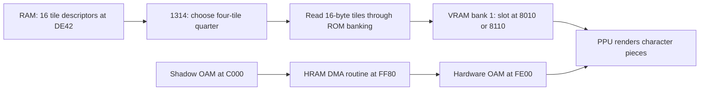

# Tintin's opening-scene tile upload path

## What is verified

The replay through frame 4200, traced during frames 2480–2560, contains 65 complete
64-byte transfers into VRAM bank 1. All **4,160 transferred bytes** match the
corresponding ROM bytes, with no rejected VRAM writes in these batches.
The observed source banks are 0, 7 and 8. This verifies the copy path for this scene;
it does not recover the full animation state machine or every game's asset format.



The descriptor producer is now verified in [animation.md](animation.md).
The shadow-OAM producer and its complete positioning rules remain to be traced.

## Named entry points

All addresses below are in fixed ROM bank 0. The generated wrappers retain the
original execution body; only names and comments changed.

| Address | New name | Descriptor start | Destination within slot |
|---|---|---|---|
| `$1314` | `tintin_upload_actor_tile_quarter` | Dispatches below | Selects VRAM bank 1 |
| `$0EE0` | `tintin_upload_actor_tiles_0_to_3` | `$DE42` | `+$00` |
| `$0FED` | `tintin_upload_actor_tiles_4_to_7` | `$DE4E` | `+$40` |
| `$10FA` | `tintin_upload_actor_tiles_8_to_11` | `$DE5A` | `+$80` |
| `$1207` | `tintin_upload_actor_tiles_12_to_15` | `$DE66` | `+$C0` |

These entries live in `generated/tintin/tintin_funcs_2.c`. Search for their new
names or the `Named:` comments on original address labels. The shared `body_0d13`
contains multiple entries and has deliberately retained its address-based name.

The four upload branches are **tail continuations**, not normal independent calls:
`$1314` pushes saved AF before jumping to a branch, and the branch pops it before
returning. Calling a branch directly without that stack setup is incorrect.

## Data layout and selection

Each descriptor is three bytes: an encoded ROM bank byte, then a little-endian
16-bit source pointer. The uploader adds one to the stored bank byte, writes the
result to the banking mirror `$FF8F` and MBC5 bank register `$2000`, then copies
16 bytes. It repeats four times: four 8×8, 2bpp tiles per invocation.

`$C48C == 0` selects destination `$8010`; nonzero selects `$8110`. The quarter
adds `$00`, `$40`, `$80` or `$C0`. These are two 16-tile slots (IDs 1–16 and 17–32).
They are consistent with alternating animation storage; the exact synchronization
between slot selection and visible OAM indices still needs a producer-side trace.

The dispatcher reads `$DF72 & $7F`. Its branches are exact:

| Masked selector | Quarter |
|---|---|
| 0 | tiles 12–15 |
| 1 | tiles 0–3 |
| 2 | tiles 4–7 |
| any other value | tiles 8–11 |

The old VRAM-bank mirror `$FFFC` is saved, VRAM bank 1 is selected via `$FF4F`,
and the old value is restored at the end. The surrounding caller restores the
ROM bank at `$0EC0`–`$0EC5`; the upload routine alone does not do that.

Read [graphics_reference.c](graphics_reference.c) for the compact data-flow version.
It omits guest instruction timing, CPU flags, register clobbers, interrupt yields,
and stack conventions, so it must not replace the generated implementation as-is.

## OAM transfer and the lower screen region

The trace observes 65 DMA launches from PC `$FF82`, each with source `$C000`.
The matching HRAM routine template is at ROM `$0B7D` (bank 0): load DMA source
high byte `$C0`, write `$FF46`, count down from `$28`, return. `$FF80` is its runtime
entry, with the register write at `$FF82`. The shadow-OAM producer is not yet named.

LCDC writes are now tied to actual instructions:

- `$0DD2`, scanline 144: `$C9 -> $C3`, enabling objects and changing the background map.
- `$13BD`, scanline 127: `$C3 -> $C9`, disabling objects and changing the background map.

Each transition occurs 81 times in the traced 81-frame window. This confirms the
raster-dependent sprite visibility that the extraction discovered; final LCDC
alone is insufficient to decide whether a character was drawn earlier in a frame.

## Reproduce and inspect evidence

```sh
python3 tools/study_graphics.py capture
# Or re-analyze an existing log without running the game:
python3 tools/study_graphics.py analyze
```

The command uses your ignored ROM and isolated `logs/code-study/` snapshots.
It never opens or changes personal app saves. Raw trace output remains local;
`graphics-evidence.json` is a compact, reviewable result with examples and counts.

The next bounded task is the shadow-OAM layout producer after frame staging.
The bank-9 descriptor source and frame selector are documented in [animation.md](animation.md).
